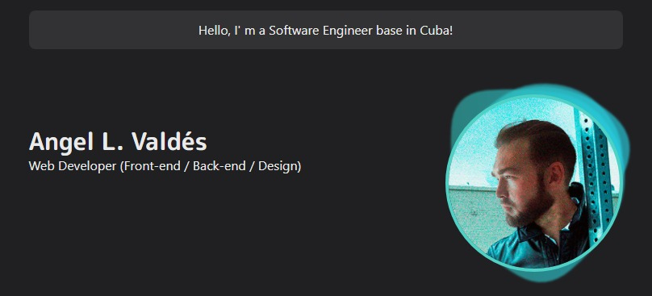

# 🪐alvaldes.vercel.app

---

👋Hi guys, here is my personal web site. Build as a [Next.js](https://nextjs.org/) project bootstrapped with `create-next-app`.

## 🛠️Built using

---

- [Next.js](https://nextjs.org/) - A React framework with hybrid static & server rendering, and route pre-fetching, etc.

- [ChackraUI](https://chakra-ui.com/) - A simple, modular and accessible component library for React.

- [Framer Motion](https://www.framer.com/motion/) - An animation library for React.

- [Vercel](https://vercel.com/) - A cloud platform that enables developers to host websites and web services.

## 👟Running locally

---

```sh
$ git clone https://github.com/alvaldes/Homepage.git
$ cd Homepage
$ npm install
$ npm run dev  # Open http://localhost:3000 with your browser
```

## 📂**Project Structure**

---

```sh
$PROJECT_ROOT
│   # Page files
├── pages
│   # React component files
├── components
│   # Non-react modules
├── lib
│   # Static files for images
└── public
│   # Css files
└── styles
```

## Contribute 🤜🤛

---

If you find a bug, or would like to incorporate new features, you are definitely welcome to create a Pull Request to improve the page👍.

## License

---

Copyright (c) 2022 Angel L. Valdés [MIT License](https://opensource.org/licenses/MIT)